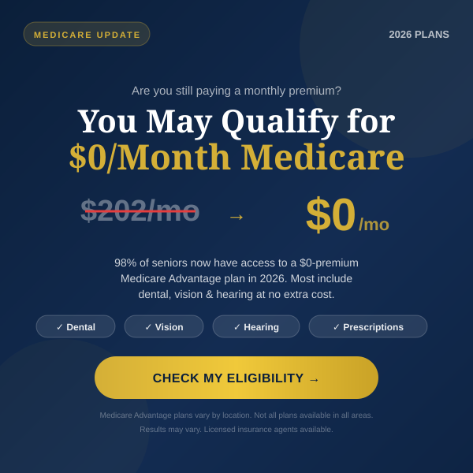
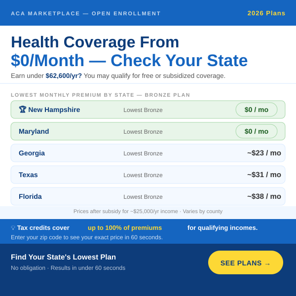
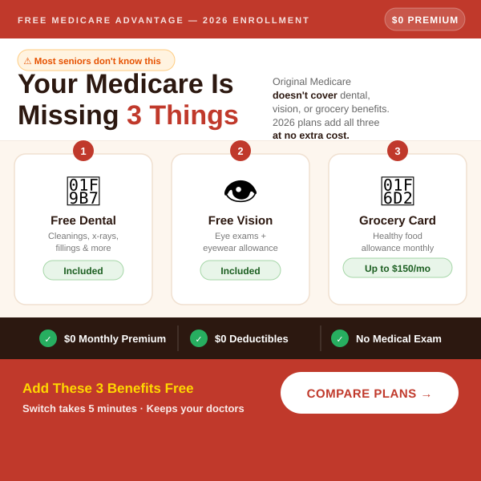

# ACA & Medicare Ad Creatives — 2026

Display & native ad creatives for RevContent, Taboola, Outbrain, and MGID.  
Targeting seniors on news sites, apps, and websites (Today.com, AOL, Newsbreak, NY Post).

---

## Ad 01 — Loss Aversion Hook
**"You May Qualify for $0/Month Medicare"**  
Target: Medicare seniors 65+ · Expected CTR: 0.8–1.4%

---

## Ad 02 — Geographic Price Table
**"Health Coverage From $0/Month — Check Your State"**  
Target: Uninsured adults 50–64 · Expected CTR: 0.9–1.6%

---

## Ad 03 — FOMO Benefit Stack
**"Your Medicare Is Missing 3 Things"**  
Target: Original Medicare seniors 65+ · Expected CTR: 1.0–1.8%

---

## Key Research — 2026 Pricing

| Program | Lowest Price | Notes |
|---|---|---|
| ACA Bronze (New Hampshire) | **$0/mo** | After subsidies, ~$25K income |
| ACA Bronze (Maryland) | **$0/mo** | Lowest Bronze & Gold nationally |
| ACA Bronze (Georgia) | ~$23/mo | After subsidies |
| ACA Bronze (Florida) | ~$38/mo | After subsidies |
| Medicare Advantage | **$0/mo** | 98% of seniors have access |
| Medicare Advantage (avg) | $14/mo | Across all enrollees |
| Grocery Card (D-SNP) | Up to $150/mo | Chronic condition plans |

> Full analysis: [ads/aca-medicare-ad-analysis-report.md](ads/aca-medicare-ad-analysis-report.md)
